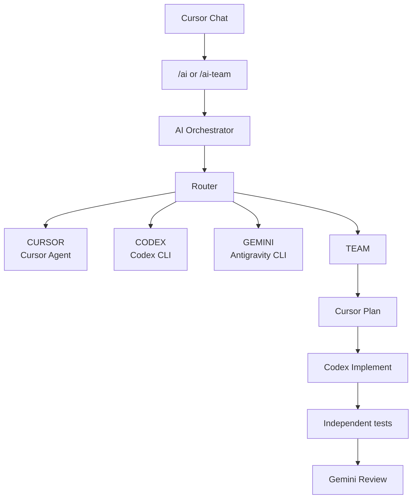
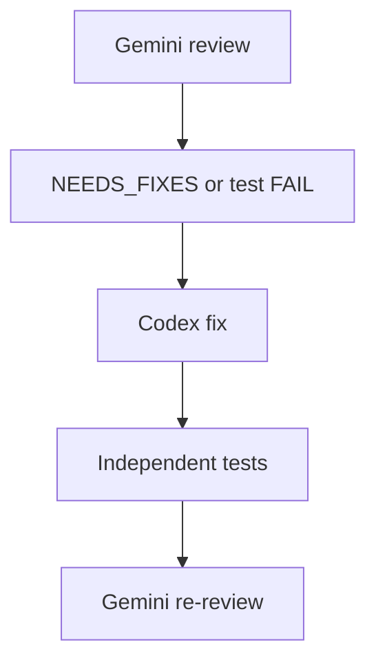

# Multi-Model AI Orchestrator

A local multi-model coding orchestrator for Cursor that intelligently routes development tasks between Cursor Agent, OpenAI Codex, Google Gemini/Antigravity, or a coordinated multi-agent team workflow.

Current version: **v0.8.0** (see `package.json`).

## Overview

Choosing the right coding model for every task is slow and easy to get wrong. This project is a local orchestrator that sits between Cursor Chat and several CLI workers. You describe the work once; the orchestrator selects a route, isolates Git changes, runs the worker, and (for modifying routes) executes the target project's own tests.

Instead of manually picking one AI model for every development task, the orchestrator can select between:

- **Cursor Agent / Cursor models** for UI, CSS, frontend, and general development
- **OpenAI Codex CLI** for focused coding, bug fixes, backend work, and tests
- **Google Gemini via Antigravity CLI** for analysis, architecture review, and large-context investigation
- **TEAM workflow** for higher-risk work that needs a plan, implementation, independent tests, and review

It is designed primarily for **local development inside Cursor on Windows**. The opened project is the source repository. This orchestrator directory stores run logs and isolated Git worktrees; it is not the repo you normally edit.

## Architecture



TEAM review loop when Gemini returns `NEEDS_FIXES` or independent tests fail (bounded by `--max-fix-rounds`, default 2):



The orchestrator itself does not merge to `main`/`master` and does not push.

## Features

Implemented in v0.8.0:

- Automatic task routing (`CURSOR`, `CODEX`, `GEMINI`, `TEAM`) with a confidence score
- Explicit worker modes that override automatic routing
- Cursor models through Cursor Agent CLI (default model: `auto`)
- Codex implementation worker (`codex exec`, non-interactive)
- Gemini analysis and review worker through Antigravity CLI (`agy -p`)
- TEAM workflow: Cursor plans, Codex implements, independent tests run, Gemini reviews
- Codex fix loop after test failures or `NEEDS_FIXES` (default max 2 rounds)
- Git worktree isolation under this project's `worktrees/` directory
- Main workspace protection: dirty source repos are refused; unexpected source changes are a safety failure
- Generated `ai/<run-id>` branches
- Optional `--commit-on-pass` on the isolated branch only
- Run logs under `runs/<run-id>/`
- Cursor `/ai` and `/ai-team` skills (installed by script)
- `npm run doctor` environment checks
- Worker smoke tests (`npm run cursor-test`, `npm run agy-test`)
- Independent test runner for the target project (npm, PHPUnit via Artisan, Flutter/Dart, Cargo, Go, .NET, pytest)
- Per-worker timeouts, process-tree kill on Windows, and limited retries for transient CLI/network failures
- Artifact cleanup command (`npm run cleanup`, dry-run by default)
- Gemini read-only safety: `--mode plan --sandbox`, git snapshot before/after, reject if files changed

`--mode agy` is accepted as backwards compatibility for `gemini`. User-facing labels say **GEMINI**.

## Routing

Explicit `--mode` values override automatic routing and report confidence 100%.

### CURSOR

UI, CSS, general frontend, documentation, and quick development work.

Example: `/ai Improve the dashboard layout`

### CODEX

Focused coding, backend implementation, bug fixes, and tests.

Example: `/ai Fix the registration validation bug and add tests`

### GEMINI

Repository analysis, architecture analysis, review, and large-context investigation. Gemini is treated as read-only; modifying the worktree is a safety violation.

Example: `/ai Analyze this repository and identify maintainability issues`

### TEAM

Complex or high-risk work that should be planned, implemented, tested, and independently reviewed.

Example: `/ai-team Refactor authentication across the application and add tests`

## Requirements

Verified on **Windows**. Linux and macOS are **not verified**.

You need:

- Windows
- Git
- Node.js 20 or later
- npm
- Cursor
- Cursor Agent CLI
- OpenAI Codex CLI
- Google Antigravity CLI (`agy`)

## Installation

1. Clone the repository:

```powershell
git clone https://github.com/trisha918/multi-model-ai-orchestrator.git
```

2. Enter the repository:

```powershell
cd multi-model-ai-orchestrator
```

3. Install dependencies:

```powershell
npm install
```

This project currently has no npm runtime packages; `npm install` still prepares a local `node_modules` metadata tree and is the expected first step.

4. Verify the environment:

```powershell
npm run doctor
```

Doctor is read-only. It prints tool versions, authentication status, timeout configuration, and the `worktrees/` and `runs/` paths.

### Authentication

Use the CLIs themselves. The orchestrator does not store API keys in this repository.

| Worker | Check | Typical login |
| --- | --- | --- |
| Codex | `codex login status` should report logged in | `codex login` |
| Antigravity / Gemini | `agy models` should succeed without modifying files | Sign in to Antigravity, then retry `agy models` |
| Cursor Agent | resolved `agent.cmd` / Cursor Agent `status` should report logged in | Run the resolved agent with `login` |

Then re-run `npm run doctor` and, for Cursor, `npm run cursor-test`.

Cursor Agent is discovered from `%LOCALAPPDATA%\cursor-agent\` (`agent.cmd`, or the newest `versions\<ver>\cursor-agent.cmd`). PATH is not required. Codex is resolved from `%APPDATA%\npm\codex.cmd` or PATH. Antigravity is resolved from `%LOCALAPPDATA%\agy\bin\agy.exe` or PATH.

## Cursor Skills Installation

Install `/ai` and `/ai-team` into your user Cursor skills directory:

```powershell
powershell -ExecutionPolicy Bypass -File .\scripts\install-cursor-skills.ps1
```

The script writes skill files under `%USERPROFILE%\.cursor\skills\` and points them at **this clone** of the orchestrator via `scripts\run-task.ps1`. After installation, restart Cursor or reload the window.

Open the **project you want to work on**, not this orchestrator repository, unless you intentionally want the orchestrator to modify itself.

## Usage from Cursor Chat

```text
/ai Fix the registration validation bug and add tests
/ai Analyze this repository and identify maintainability issues
/ai Improve the dashboard layout
/ai-team Refactor authentication across the application and add tests
```

- `/ai` uses `--mode auto` (router chooses CURSOR, CODEX, GEMINI, or TEAM).
- `/ai-team` forces `--mode team`.

The runner auto-detects the Git root of the opened workspace. Task text is passed verbatim to PowerShell `-Task`. Do not add `--in-place` from the skills.

## Manual CLI Usage

From the orchestrator clone:

```powershell
npm run task -- --repo "C:\Projects\my-app" --mode auto --commit-on-pass --task "Fix the login bug and add tests"
```

Supported modes:

- `auto`
- `cursor`
- `codex`
- `gemini`
- `team`
- `agy` (alias of `gemini`)

Other flags:

- `--commit-on-pass` — commit on the isolated `ai/...` branch when implementation succeeded, tests are PASS or SKIP, TEAM review is PASS, and no safety violation
- `--max-fix-rounds 2` — TEAM Codex fix rounds (0–5)
- `--cursor-model auto` — Cursor Agent model
- `--branch ai/my-task` — optional branch name
- `--windows-unelevated` — Codex Windows sandbox fallback
- `--in-place` — disables Git isolation (not recommended; agents operate in the source repo)

There is also `scripts\run-task.ps1`, which the Cursor skills call. If `-Repo` is omitted, it uses `git rev-parse --show-toplevel` from the current directory.

## Git Safety

- Modifying tasks run in isolated Git worktrees under this project's `worktrees/` folder.
- The main workspace should remain unchanged.
- The source repository must normally be clean (`git status --short` empty). Uncommitted changes refuse the run.
- The orchestrator never automatically resets, cleans, or discards user files.
- An initial Git commit is required before worktrees can be created.
- AI work is created on `ai/<run-id>` branches (or a `--branch` you supply).
- There is no automatic merge to `main`/`master` and no automatic push or deploy.
- Successful worktrees are removed with `git worktree remove` after verifying the path is this run's directory (unless `AI_KEEP_SUCCESS_WORKTREES=true`). Branches are kept.
- Failed worktrees are preserved for debugging by default (`AI_KEEP_FAILED_WORKTREES=true`).

## Run Logs

Artifacts are written to `runs/<run-id>/` and are gitignored. A run may include:

| File | Contents |
| --- | --- |
| `task.txt` | The task text |
| `route.json` | Route, reason, confidence, risk, complexity |
| `meta.json` | Run metadata, worktree, branch, commit result |
| `plan.txt` | TEAM Cursor plan |
| `implementation.txt` | Worker implementation summary |
| `review.txt` | Gemini analysis or TEAM review |
| `fix-round-N.txt` | TEAM Codex fix output |
| `tests.txt` | Independent test command, exit code, output |
| `diff.patch` | Worktree git diff when present |
| `timings.json` | Stage durations |
| `stages.json` | Stage status list |
| `usage.json` | Duration/attempts/model; token usage only if a CLI provides it |
| `error.txt` | Failure stack when a stage throws |
| `gemini-safety.diff` | Diff if Gemini modified files |

## Testing

```powershell
npm test
npm run cursor-test
npm run agy-test
npm run doctor
npm run cleanup
```

| Command | What it validates |
| --- | --- |
| `npm test` | Unit tests for routing, tooling, worktrees, Cursor Agent args, process helpers, test-runner detection, and cleanup |
| `npm run cursor-test` | Cursor Agent status plus a small read-only headless prompt |
| `npm run agy-test` | Antigravity headless prompt (`ANTIGRAVITY_OK`) |
| `npm run doctor` | Tool presence, versions, auth checks, config paths |
| `npm run cleanup` | Dry-run listing of old `runs/` and `worktrees/` folders |

Cleanup apply example:

```powershell
npm run cleanup -- --apply --older-than-days 7
```

Only artifact folders whose names match orchestrator run-id patterns are considered.

## Configuration

Environment variables (defaults shown):

| Variable | Default | Meaning |
| --- | --- | --- |
| `AI_CURSOR_TIMEOUT_MS` | `300000` (5 min) | Cursor Agent timeout |
| `AI_CODEX_TIMEOUT_MS` | `600000` (10 min) | Codex timeout |
| `AI_GEMINI_TIMEOUT_MS` | `300000` (5 min) | Gemini/Antigravity timeout |
| `AI_TEST_TIMEOUT_MS` | `600000` (10 min) | Independent tests timeout |
| `AI_WORKER_MAX_RETRIES` | `1` | Extra attempts for transient CLI/network failures only |
| `AI_KEEP_SUCCESS_WORKTREES` | `false` | Keep worktrees after success |
| `AI_KEEP_FAILED_WORKTREES` | `true` | Keep worktrees after failure |

Retries do **not** apply to test failures, auth failures, dirty repos, or review `NEEDS_FIXES`. Timeouts terminate the process tree (`taskkill /T` on Windows). Timed-out stages are `TIMEOUT`.

Copy `.env.example` only if you want a local reminder of these names. The Node process still needs the variables in the real environment unless you load them yourself.

## Troubleshooting

### Cursor Agent is not recognized

Doctor looks for `%LOCALAPPDATA%\cursor-agent\agent.cmd` or the newest `versions\<ver>\cursor-agent.cmd`. PATH is not required. Install Cursor Agent CLI, then run `npm run doctor` and `npm run cursor-test`.

### Workspace Trust Required

Cursor Agent may refuse untrusted directories. For orchestrator-managed isolated worktrees, the Cursor worker may pass `--trust` only after verifying the path is this run's folder under orchestrator `worktrees/`. Do not enable global `--yolo`. Arbitrary directories are not auto-trusted.

### Dirty repository

```powershell
git status --short
```

Commit or stash your own changes first. The orchestrator never automatically resets user changes.

### Repository has no initial commit

Create an initial Git commit before running a modifying task. Worktrees require a valid `HEAD`.

### Worker authentication problems

Run `npm run doctor`, then the individual login/status checks in [Authentication](#authentication).

### Antigravity / Gemini issues

Headless file reads currently require `--dangerously-skip-permissions` because the CLI cannot prompt. v0.8 still runs Gemini only in the isolated worktree, uses `--mode plan --sandbox`, snapshots git status before/after, and rejects the review if files changed. Prompts state that the worker is read-only.

### Codex Windows sandbox errors

If Codex reports helper/sandbox setup errors on Windows, re-run with `--windows-unelevated`, or run inside WSL2 (WSL2 is not verified as a first-class host for this project).

## Security Notes

- Tasks may execute code (workers and independent tests).
- Workers can modify files inside isolated worktrees.
- Always use Git. Review AI branches before merging.
- Do not commit secrets, tokens, cookies, or local CLI session files.
- Avoid broad permission bypasses. `--trust` is limited to verified orchestrator worktrees. Gemini's skip-permissions flag is paired with sandbox, plan mode, and a git change check.
- The main branch is not automatically merged or pushed.

## Project Status

The project is under active development.

Current version: **v0.8.0**

## Roadmap

Possible future goals (not implemented):

- Easier portable installer
- Linux/macOS validation
- Smarter Cursor model selection
- GitHub pull-request automation
- Usage/quota-aware routing
- Richer policy configuration

## License

This repository does not currently include a license file.

## Contributing

1. Fork the repository and create a branch.
2. Keep Windows-first process spawning (`shell: false`, argument arrays).
3. Run `npm test` and `npm run doctor` before opening a pull request.
4. Do not commit `runs/`, `worktrees/`, `.env`, credentials, or generated logs.

## Disclaimer

AI-generated code can be wrong, incomplete, or insecure. Review diffs, run the project's tests, and apply your own judgment before deploying anything to production.
