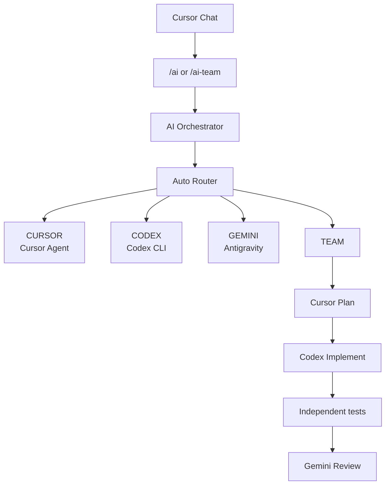
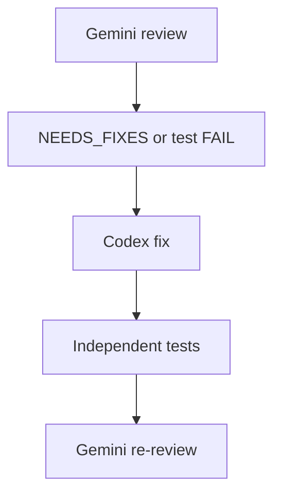

# Multi-Model AI Orchestrator

A local multi-model coding orchestrator for Cursor that routes development tasks between Cursor Agent, OpenAI Codex, Google Gemini/Antigravity, or a coordinated multi-agent team.

Current version: **v0.8.0**

**Validated platform: Windows.** macOS and Linux are not claimed and have not been tested as supported hosts.

## Overview

This project sits between Cursor Chat and several local CLI workers. You describe a development task once. The orchestrator chooses a route, isolates Git changes in a worktree, runs the selected worker, and for modifying routes executes the **target project's own tests**.

The opened Cursor workspace is the source repository. This orchestrator directory stores `runs/` and `worktrees/`. It is not the project you normally edit.

Instead of picking one model by hand for every task, v0.8 can send work to:

- **CURSOR** — Cursor Agent CLI (default model `auto`)
- **CODEX** — OpenAI Codex CLI (`codex exec`)
- **GEMINI** — Google Gemini via Antigravity CLI (`agy -p`)
- **TEAM** — Cursor plan, Codex implement, independent tests, Gemini review, bounded Codex fix loop

## Architecture



TEAM when Gemini returns `NEEDS_FIXES` or independent tests fail:



The orchestrator does not merge to `main`/`master` and does not push.

## CURSOR / CODEX / GEMINI / TEAM routes

| Route | Worker | Typical use |
| --- | --- | --- |
| `CURSOR` | Cursor Agent CLI | UI, CSS, frontend, docs, quick edits |
| `CODEX` | Codex CLI | Focused coding, backend, bug fixes, tests |
| `GEMINI` | Antigravity CLI | Analysis, architecture, review, large-context investigation |
| `TEAM` | Cursor + Codex + tests + Gemini | High-risk or cross-cutting work |

`--mode agy` is a backwards-compatible alias of `gemini`. Labels still say **GEMINI**.

### CURSOR

Example: `/ai Improve the dashboard layout`

### CODEX

Example: `/ai Fix the registration validation bug and add tests`

### GEMINI

Read-only analysis. If Gemini changes files, the run is rejected as a safety violation.

Example: `/ai Analyze this repository and identify maintainability issues`

### TEAM

Example: `/ai-team Refactor authentication across the application and add tests`

## Auto Router

`--mode auto` (used by `/ai`) classifies the task text and picks `CURSOR`, `CODEX`, `GEMINI`, or `TEAM`. It records a **route confidence** score (0–1) plus risk and complexity in `runs/<run-id>/route.json`.

Explicit `--mode cursor|codex|gemini|agy|team` **overrides** the auto router and reports confidence **100%**.

## Cursor → Codex → Gemini TEAM workflow

1. **Cursor** writes a read-only implementation plan (`plan.txt`).
2. **Codex** implements in the isolated worktree (`implementation.txt`).
3. The **independent test runner** runs the project's real test command.
4. **Gemini** reviews the current tree and git diff. The first non-empty line of the review must be `PASS` or `NEEDS_FIXES`.

## Gemini NEEDS_FIXES → Codex fix → tests → Gemini re-review

If tests fail/timeout or Gemini returns `NEEDS_FIXES`, Codex receives the test output and/or review text, applies a fix (`fix-round-N.txt`), tests run again, and Gemini re-reviews. Rounds are bounded by `--max-fix-rounds` (default **2**, max 5). There is no automatic merge.

## Git worktree isolation

Modifying tasks create an isolated Git worktree under this project's `worktrees/` directory, usually on branch `ai/<run-id>` (or `--branch`). Agents edit that copy, not your opened workspace.

`--in-place` disables isolation and is not recommended. Cursor skills do not pass `--in-place`.

## Main workspace protection

- Source must be a Git repo with a valid `HEAD` (at least one commit).
- A dirty source tree **refuses** the run. The orchestrator never `reset`s, `clean`s, or discards your files.
- After the run, the source fingerprint is checked again. Unexpected source changes are a **SAFETY FAILURE**.
- Optional `--commit-on-pass` commits only on the isolated `ai/...` branch when implementation succeeded, tests are PASS or SKIP, TEAM review is PASS, and there is no safety violation.

## Independent test runner

After CURSOR, CODEX, and TEAM implementation (and after each fix round), the orchestrator runs a real test command in the worktree. **PASS/FAIL is the process exit code**, not an agent claim.

Detection (first match only):

1. `package.json` `scripts.test` → `npm test`
2. `artisan` → `php artisan test`
3. Flutter `pubspec.yaml` → `flutter test`
4. other `pubspec.yaml` → `dart test`
5. `Cargo.toml` → `cargo test`
6. `go.mod` → `go test ./...`
7. `*.sln` / `*.csproj` → `dotnet test`
8. pytest layout → `pytest`

If nothing matches: `Tests: SKIP` with reason `No supported test runner detected`. SKIP is not reported as PASS. FAIL/TIMEOUT blocks `--commit-on-pass`.

## Timeouts

| Worker | Default | Environment variable |
| --- | --- | --- |
| Cursor | 5 minutes | `AI_CURSOR_TIMEOUT_MS` |
| Codex | 10 minutes | `AI_CODEX_TIMEOUT_MS` |
| Gemini | 5 minutes | `AI_GEMINI_TIMEOUT_MS` |
| Tests | 10 minutes | `AI_TEST_TIMEOUT_MS` |

Timeouts kill the process tree (`taskkill /T` on Windows). Timed-out stages are `TIMEOUT`, not success.

## Retry policy

`AI_WORKER_MAX_RETRIES` default **1** (one extra attempt). Retries apply only to **transient CLI/network** failures (timeouts, rate limits, typical network errors). They do **not** apply to test failures, auth failures, dirty repos, or review `NEEDS_FIXES`.

## Worktree cleanup

| Variable | Default |
| --- | --- |
| `AI_KEEP_SUCCESS_WORKTREES` | `false` (remove after success via `git worktree remove`, after verifying the path is this run under `worktrees/`) |
| `AI_KEEP_FAILED_WORKTREES` | `true` (keep for debugging) |

Branches are kept. Maintenance (dry-run by default):

```powershell
npm run cleanup
npm run cleanup -- --older-than-days 7
npm run cleanup -- --apply --older-than-days 7
```

Only `runs/` and `worktrees/` folders whose names match orchestrator run-id patterns are considered.

## Run logs

Gitignored artifacts live in `runs/<run-id>/`:

| File | Contents |
| --- | --- |
| `task.txt` | Task text |
| `route.json` | Route, reason, **confidence**, risk, complexity |
| `meta.json` | Run metadata, worktree, branch, commit result |
| `plan.txt` | TEAM Cursor plan |
| `implementation.txt` | Implementation summary |
| `review.txt` | Gemini analysis or TEAM review |
| `fix-round-N.txt` | TEAM Codex fix |
| `tests.txt` | Independent test command, exit code, output |
| `diff.patch` | Worktree diff when present |
| `timings.json` | Stage durations |
| `stages.json` | Stage status list |
| `usage.json` | Duration, attempts, model; token counts only if a CLI provides them |
| `error.txt` | Failure stack |
| `gemini-safety.diff` | Diff if Gemini modified files |

## Route confidence

Auto routing writes `confidence` on the banner and in `route.json`. Explicit modes set confidence to `1`. Token or dollar cost is **not** available for every subscription-based worker; `usage.json` stores `usage: "unavailable"` unless the CLI returns usage data.

## `/ai`

Install skills, reload Cursor, then in the **target project** chat:

```text
/ai Fix the registration validation bug and add tests
/ai Analyze this repository and identify maintainability issues
/ai Improve the dashboard layout
```

`/ai` runs `--mode auto`. The runner detects the opened repo Git root. Task text is passed verbatim to `-Task`.

## `/ai-team`

```text
/ai-team Refactor authentication across the application and add tests
```

Forces `--mode team` (same TEAM workflow as above).

```powershell
powershell -ExecutionPolicy Bypass -File .\scripts\install-cursor-skills.ps1
```

Skills are written under `%USERPROFILE%\.cursor\skills\` and point at **this clone**. Restart or reload Cursor afterward.

## Installation

Windows only (validated):

```powershell
git clone https://github.com/trisha918/multi-model-ai-orchestrator.git
cd multi-model-ai-orchestrator
npm install
npm run doctor
```

This package currently has no npm runtime dependencies; `npm install` is still the expected first step.

### Authentication prerequisites

The orchestrator does not store API keys in this repository. Authenticate each CLI:

| Worker | Status check | Typical login |
| --- | --- | --- |
| Codex | `codex login status` reports logged in | `codex login` |
| Antigravity / Gemini | `agy models` succeeds without modifying files | Sign in to Antigravity |
| Cursor Agent | resolved agent `status` reports logged in | resolved agent `login` |

Then `npm run doctor`. Cursor Agent is discovered from `%LOCALAPPDATA%\cursor-agent\` (`agent.cmd` or newest `versions\<ver>\cursor-agent.cmd`). PATH is not required. Codex: `%APPDATA%\npm\codex.cmd` or PATH. Antigravity: `%LOCALAPPDATA%\agy\bin\agy.exe` or PATH.

## Windows requirements

- Windows (validated host)
- Git
- Node.js 20+
- npm
- Cursor
- Cursor Agent CLI
- OpenAI Codex CLI
- Google Antigravity CLI (`agy`)

## Commands

```powershell
npm run doctor
npm test
npm run cursor-test
npm run agy-test
npm run cleanup
npm run task -- --repo "C:\Projects\my-app" --mode auto --commit-on-pass --task "Fix the login bug and add tests"
```

| Command | Purpose |
| --- | --- |
| `npm run doctor` | Read-only tool versions, auth, timeouts, `runs/` and `worktrees/` paths |
| `npm test` | Unit tests (routing, tooling, worktrees, Cursor args, process, test-runner, cleanup) |
| `npm run cursor-test` | Cursor Agent status + small read-only headless prompt |
| `npm run agy-test` | Antigravity headless prompt (`ANTIGRAVITY_OK`) |
| `npm run cleanup` | Dry-run listing of old artifact folders |

Manual modes: `auto`, `cursor`, `codex`, `gemini`, `team`, `agy`. Other flags: `--commit-on-pass`, `--max-fix-rounds`, `--cursor-model`, `--branch`, `--windows-unelevated`, `--in-place`.

## Troubleshooting

### Cursor Agent is not recognized

Confirm `%LOCALAPPDATA%\cursor-agent\agent.cmd` or `versions\<ver>\cursor-agent.cmd`. PATH is optional. Then `npm run doctor` and `npm run cursor-test`.

### Workspace Trust Required

`--trust` is passed only for a verified orchestrator worktree under `worktrees/<run-id>`. Do not enable global `--yolo`. Arbitrary directories are not auto-trusted.

### Dirty repository

```powershell
git status --short
```

Commit or stash first. The orchestrator never automatically resets user changes.

### Repository has no initial commit

Create an initial commit before a modifying task. Worktrees need a valid `HEAD`.

### Worker authentication

`npm run doctor`, then the login/status checks in [Authentication prerequisites](#authentication-prerequisites).

### Antigravity / Gemini

See [Known limitations](#known-limitations). Isolated worktree, `--mode plan --sandbox`, git snapshot, reject if files changed.

### Codex Windows sandbox errors

Re-run with `--windows-unelevated`. WSL2 is not a validated host for this project.

## Security notes

- Tasks may execute code (workers and independent tests).
- Workers can modify files inside isolated worktrees.
- Always use Git. **Review AI-generated branches before merging.**
- Do not commit secrets, tokens, cookies, or local CLI session files.
- Avoid broad permission bypasses. `--trust` is limited to verified orchestrator worktrees.
- Main is not automatically merged or pushed.

## Known limitations

- Gemini/Antigravity headless review may still require `--dangerously-skip-permissions`, mitigated through sandboxing, isolated worktrees, read-only prompting, and Git change detection.
- Exact token/dollar cost is not available for all subscription-based workers.
- AI-generated branches must be reviewed before merging.
- Windows is the validated platform; macOS/Linux are untested as hosts.
- There is no automatic GitHub PR, merge, or deploy.

## Roadmap

Not implemented:

- Easier portable installer
- Linux/macOS validation
- Smarter Cursor model selection
- GitHub pull-request automation
- Usage/quota-aware routing
- Richer policy configuration

## Contributing

1. Fork and branch from `main`.
2. Keep Windows-first spawning (`shell: false`, argument arrays; wrap `.cmd` via `cmd.exe /d /s /c`).
3. Run `npm test` (expect 33+ passing) and `npm run doctor`.
4. Do not commit `runs/`, `worktrees/`, `.env`, credentials, or generated logs.
5. Open a pull request. Do not push, merge, or deploy from the orchestrator itself.

## License

This repository does not currently include a license file.

## Disclaimer

AI-generated code can be wrong, incomplete, or insecure. Review diffs, run the project's tests, and apply your own judgment before production use.
