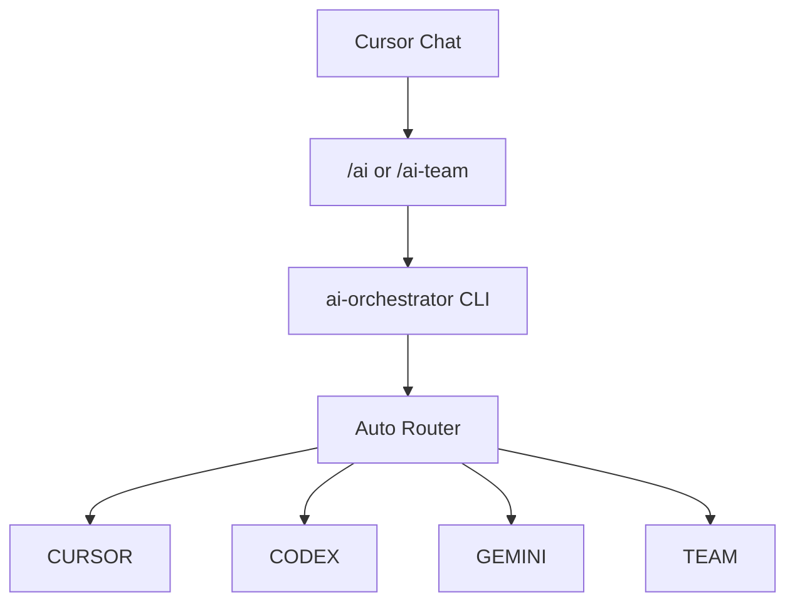

# Multi-Model AI Orchestrator

A local multi-model coding orchestrator for Cursor that routes development tasks between Cursor Agent, OpenAI Codex, Google Gemini/Antigravity, or a coordinated multi-agent team.

Current version: **v0.9.0**

**Validated platform: Windows.** macOS and Linux are not claimed and have not been tested as supported hosts.

## Quick Start

On a new Windows PC:

```powershell
git clone https://github.com/trisha918/multi-model-ai-orchestrator.git
cd multi-model-ai-orchestrator
.\install.ps1
```

If PowerShell blocks the script:

```powershell
powershell -ExecutionPolicy Bypass -File .\install.ps1
```

Then:

```powershell
ai-orchestrator doctor
```

Open any Git project in Cursor and type:

```text
/ai Fix the login bug and add tests
```

or:

```text
/ai-team Refactor authentication safely
```

You should not need to know where this repository was cloned. Cursor skills call the global `ai-orchestrator` command, not an absolute clone path.

## Overview

This project sits between Cursor Chat and several local CLI workers.

```text
Cursor Chat
    ↓
Global Cursor Skill (/ai or /ai-team)
    ↓
ai-orchestrator CLI
    ↓
Router
    ├── Cursor
    ├── Codex
    ├── Gemini
    └── Team
```

The opened Cursor workspace is the source repository. Runtime artifacts live under `%LOCALAPPDATA%\MultiModelAIOrchestrator\`. The orchestrator clone is not the project you normally edit.

v0.9 can send work to:

- **CURSOR** — Cursor Agent CLI (default model `auto`)
- **CODEX** — OpenAI Codex CLI (`codex exec`)
- **GEMINI** — Google Gemini via Antigravity CLI (`agy -p`)
- **TEAM** — Cursor plan, Codex implement, independent tests, Gemini review, bounded Codex fix loop

## Architecture



The orchestrator does not merge to `main`/`master` and does not push.

## Global CLI

After installation, these commands work from any PowerShell directory:

```powershell
ai-orchestrator doctor
ai-orchestrator version
ai-orchestrator run --repo "C:\Projects\My App" --mode auto --commit-on-pass --task "Fix the login bug and add tests"
ai-orchestrator cleanup
ai-orchestrator config show
ai-orchestrator config path
ai-orchestrator install-skills
ai-orchestrator uninstall-skills
```

`--version` and `-v` are aliases of `version`.

Development / backwards-compatible npm scripts still work from the clone:

```powershell
npm run doctor
npm run task -- --repo "C:\Projects\my-app" --mode auto --commit-on-pass --task "Fix the login bug and add tests"
npm run cleanup
npm run cursor-test
npm run agy-test
npm test
```

Do not invoke `node src/orchestrator.mjs` as the normal user entry point.

## Installation

`.\install.ps1` is idempotent. It:

1. Checks PowerShell, Git, Node.js (must satisfy `package.json` `engines.node`, currently `>=20`), and npm
2. Runs `npm install` in the clone
3. Runs `npm link` so `ai-orchestrator` is on the npm global bin
4. Verifies `ai-orchestrator version`
5. Detects Cursor Agent, Codex, and Antigravity (does **not** install them)
6. Installs global `/ai` and `/ai-team` skills
7. Runs `ai-orchestrator doctor`
8. Prints a setup summary

The installer never silently installs Cursor, Cursor Agent, Codex, Antigravity, Git, or Node. Missing tools are reported with an actionable hint.

### Uninstallation

```powershell
.\uninstall.ps1
```

This removes only:

- the global `ai-orchestrator` npm link
- project-owned `/ai` and `/ai-team` skills

It does **not** uninstall Cursor, Codex, Antigravity, Node, or Git, and does **not** delete your project repositories.

Config and runtime data are kept by default. The uninstaller prints their locations. To delete them as well:

```powershell
.\uninstall.ps1 -PurgeData
```

## Portable Cursor Skills

`/ai` and `/ai-team` are installed under `%USERPROFILE%\.cursor\skills\`.

They call `ai-orchestrator`, never `C:\some\clone\scripts\run-task.ps1`.

`/ai <task>` writes the task to a UTF-8 temp file, then:

`ai-orchestrator run --repo <git-root> --mode auto --commit-on-pass --task-file <temp-file>`

`/ai-team <task>` is the same with `--mode team`.

Task text is **not** passed as `--task` from Cursor skills, so Windows PowerShell cannot strip embedded quotes. Manual CLI use may still pass `--task` (or `--task-stdin`). Skills delete only the inbox file they created.

Task input is exclusive: `--task`, `--task-file`, and `--task-stdin` cannot be combined.

If an existing skill with the same name is not owned by this project, install will refuse to overwrite it.

```powershell
ai-orchestrator install-skills
ai-orchestrator uninstall-skills
```

Reload Cursor after skill changes.

## Multiple projects

Open **Project A** in Cursor → `/ai` targets Project A.

Open **Project B** → `/ai` targets Project B.

The orchestrator clone is the target only if you opened that clone. If a Git root cannot be determined, the CLI fails clearly and does not guess another repository.

Runtime folders are shared per user, but each run gets its own run id and worktree.

## Configuration

User config (not stored in the clone):

`%APPDATA%\MultiModelAIOrchestrator\config.json`

Example:

```json
{
  "defaultMode": "auto",
  "cursorModel": "auto",
  "keepSuccessWorktrees": false,
  "keepFailedWorktrees": true,
  "workerMaxRetries": 1
}
```

```powershell
ai-orchestrator config show
ai-orchestrator config path
ai-orchestrator config set defaultMode auto
ai-orchestrator config set cursorModel auto
```

**Precedence (highest first):**

1. CLI argument
2. Environment variable
3. User config
4. Built-in default

Timeouts remain environment-driven: `AI_CURSOR_TIMEOUT_MS`, `AI_CODEX_TIMEOUT_MS`, `AI_GEMINI_TIMEOUT_MS`, `AI_TEST_TIMEOUT_MS`. Mode/model/retry/worktree-keep settings also honor `AI_DEFAULT_MODE`, `AI_CURSOR_MODEL`, `AI_WORKER_MAX_RETRIES`, `AI_KEEP_SUCCESS_WORKTREES`, `AI_KEEP_FAILED_WORKTREES`.

## Runtime data locations

| Item | Location |
| --- | --- |
| Config | `%APPDATA%\MultiModelAIOrchestrator\config.json` |
| Runs | `%LOCALAPPDATA%\MultiModelAIOrchestrator\runs\` |
| Worktrees | `%LOCALAPPDATA%\MultiModelAIOrchestrator\worktrees\` |
| Skills | `%USERPROFILE%\.cursor\skills\ai` and `ai-team` |
| Install / package | the Git clone you ran `.\install.ps1` from |

v0.8 stored `runs/` and `worktrees/` inside the clone. v0.9 uses the per-user LocalAppData directories so moving or updating the clone does not scatter runtime data. Cleanup still understands leftover clone-local artifact folders if they exist. It never touches unrelated directories.

Overrides for tests or unusual setups: `AI_ORCHESTRATOR_CONFIG_DIR`, `AI_ORCHESTRATOR_RUNTIME_ROOT`, `AI_ORCHESTRATOR_SKILLS_DIR`.

## Updating

There is **no** `ai-orchestrator update` in v0.9 (a self-updater is too easy to get wrong). From the clone:

```powershell
git pull
npm install
.\install.ps1
```

If `git pull` would not apply cleanly, fix the clone yourself. Do not use destructive Git resets unless you intend to discard local work.

### Moving the repository

1. `.\uninstall.ps1` (keeps config/runtime data)
2. Move the clone
3. From the new location, `.\install.ps1`

Skills stay global (`ai-orchestrator`) and do not need the old path.

## Authentication

Installation and login are separate. The installer does not store, copy, or sync credentials.

| Worker | Status check | Typical login |
| --- | --- | --- |
| Codex | `codex login status` reports logged in | `codex login` |
| Antigravity / Gemini | `agy models` succeeds without modifying files | Sign in to Antigravity |
| Cursor Agent | resolved agent `status` reports logged in | resolved agent `login` |

Doctor prints **ACTION REQUIRED** plus those existing commands. It does not invent login flags.

Cursor Agent discovery (PATH not required):

- `%LOCALAPPDATA%\cursor-agent\agent.cmd`
- `%LOCALAPPDATA%\cursor-agent\versions\<version>\cursor-agent.cmd`
- Prefer `node.exe` + `index.js` when present so task text is not passed through cmd delayed expansion

## CURSOR / CODEX / GEMINI / TEAM routes

| Route | Worker | Typical use |
| --- | --- | --- |
| `CURSOR` | Cursor Agent CLI | UI, CSS, frontend, docs, quick edits |
| `CODEX` | Codex CLI | Focused coding, backend, bug fixes, tests |
| `GEMINI` | Antigravity CLI | Analysis, architecture, review, large-context investigation |
| `TEAM` | Cursor + Codex + tests + Gemini | High-risk or cross-cutting work |

`--mode agy` is a backwards-compatible alias of `gemini`. Labels still say **GEMINI**.

Explicit `--mode cursor|codex|gemini|agy|team` overrides the auto router and reports confidence **100%**.

## Git worktree isolation and main workspace protection

Modifying tasks create an isolated Git worktree under the per-user `worktrees/` directory, usually on branch `ai/<run-id>`.

- Source must be a Git repo with a valid `HEAD` (at least one commit).
- A dirty source tree **refuses** the run. The orchestrator never `reset`s, `clean`s, or discards your files.
- After the run, the source fingerprint is checked again. Unexpected source changes are a **SAFETY FAILURE**.
- `--in-place` disables isolation and is not recommended. Cursor skills do not pass `--in-place`.

## Independent test runner

After CURSOR, CODEX, and TEAM implementation (and after each fix round), the orchestrator runs a real test command in the worktree. **PASS/FAIL is the process exit code**, not an agent claim.

Detection (first match only): `package.json` `scripts.test` → `npm test`; `artisan` → `php artisan test`; Flutter `pubspec.yaml` → `flutter test`; other `pubspec.yaml` → `dart test`; `Cargo.toml` → `cargo test`; `go.mod` → `go test ./...`; `*.sln` / `*.csproj` → `dotnet test`; pytest layout → `pytest`.

If nothing matches: `Tests: SKIP`. SKIP is not PASS. FAIL/TIMEOUT blocks `--commit-on-pass`.

## Timeouts, retries, cleanup

| Worker | Default | Environment variable |
| --- | --- | --- |
| Cursor | 5 minutes | `AI_CURSOR_TIMEOUT_MS` |
| Codex | 10 minutes | `AI_CODEX_TIMEOUT_MS` |
| Gemini | 5 minutes | `AI_GEMINI_TIMEOUT_MS` |
| Tests | 10 minutes | `AI_TEST_TIMEOUT_MS` |

`AI_WORKER_MAX_RETRIES` default **1**. Retries apply only to transient CLI/network failures, not test failures, auth failures, dirty repos, or review `NEEDS_FIXES`.

Successful worktrees are removed by default (`AI_KEEP_SUCCESS_WORKTREES=false`). Failed worktrees are kept (`AI_KEEP_FAILED_WORKTREES=true`).

```powershell
ai-orchestrator cleanup
ai-orchestrator cleanup --apply --older-than-days 7
npm run cleanup
```

Only run-id-shaped folders under the managed runs/worktrees roots are considered.

## Troubleshooting

### `ai-orchestrator` is not recognized

`npm link` installs a shim under the npm global prefix (often `%APPDATA%\npm`). Add that folder to your user PATH and **open a new terminal**. Then `ai-orchestrator version`.

`.\install.ps1` also replaces npm's default `ai-orchestrator.ps1` with an argument-safe shim (`@args`). Without that, PowerShell can collapse `run --repo ...` into one argument. Re-run `.\install.ps1` if a new `npm link` overwrote the shim.

### Execution policy blocks `install.ps1`

```powershell
powershell -ExecutionPolicy Bypass -File .\install.ps1
```

### Cursor Agent missing

Confirm `%LOCALAPPDATA%\cursor-agent\agent.cmd` or `versions\<ver>\cursor-agent.cmd`. The installer will not install Cursor Agent for you. Then `ai-orchestrator doctor` and `npm run cursor-test`.

### Codex missing

Required for CODEX and TEAM. Install Codex CLI yourself (`npm i -g @openai/codex`) and keep `%APPDATA%\npm` on PATH.

### Antigravity missing

Required for GEMINI and TEAM review. Expected: `%LOCALAPPDATA%\agy\bin\agy.exe`.

### Worker authentication missing

Doctor prints ACTION REQUIRED. Use `codex login`, Antigravity sign-in + `agy models`, or the resolved Cursor Agent `login`. Credentials are never copied.

### Workspace Trust Required

`--trust` is passed only for a verified orchestrator worktree. Do not enable global `--yolo`. Arbitrary directories are not auto-trusted.

### Project is not Git / has no initial commit / is dirty

```powershell
git status --short
```

Initialize git and create an initial commit before modifying tasks. Commit or stash local edits first. The orchestrator never automatically resets user changes.

### Paths with spaces

Clone paths such as `C:\AI Tools\multi-model-ai-orchestrator` and project paths such as `C:\Projects\My App` are supported. Quote paths; the CLI uses argument arrays.

## Security notes

- Tasks may execute code (workers and independent tests).
- Workers can modify files inside isolated worktrees.
- Always use Git. **Review AI-generated branches before merging.**
- Do not commit secrets, tokens, cookies, or local CLI session files.
- The installer never copies auth files or puts secrets in config.
- `--trust` is limited to verified orchestrator worktrees.
- Gemini/Antigravity remains sandboxed with git change detection; file modifications fail the run.
- Main is not automatically merged or pushed.

## Known limitations

- Gemini/Antigravity headless review may still require `--dangerously-skip-permissions`, mitigated through sandboxing, isolated worktrees, read-only prompting, and Git change detection.
- Exact token/dollar cost is not available for all subscription-based workers.
- AI-generated branches must be reviewed before merging.
- Windows is the validated platform; macOS/Linux are untested as hosts.
- There is no automatic GitHub PR, merge, deploy, or `ai-orchestrator update`.

## Contributing

1. Fork and branch from `main`.
2. Keep Windows-first spawning (`shell: false`, argument arrays; wrap `.cmd` via `cmd.exe /d /s /c`).
3. Run `npm test` and `npm run doctor`.
4. Do not commit `runs/`, `worktrees/`, `.env`, credentials, or generated logs.
5. Open a pull request. Do not push, merge, or deploy from the orchestrator itself.

## License

This repository does not currently include a license file.

## Disclaimer

AI-generated code can be wrong, incomplete, or insecure. Review diffs, run the project's tests, and apply your own judgment before production use.
