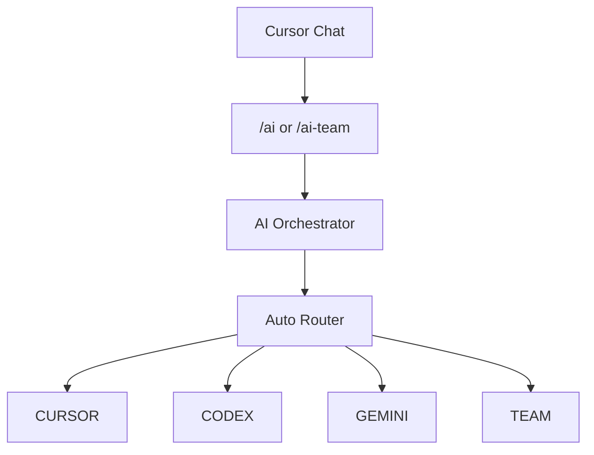

# Multi-Model AI Orchestrator

ارکستراتور محلی چندمدلی برای Cursor. کار توسعه را بین Cursor Agent، OpenAI Codex، Google Gemini از طریق Antigravity، یا گردش‌کار هماهنگ TEAM مسیر‌دهی می‌کند.

نسخه فعلی: **v0.8.0**  
پلتفرم تأییدشده: **Windows**. macOS و Linux به‌عنوان میزبان پشتیبانی‌شده ادعا نمی‌شوند.

## پروژه چیست

داخل Cursor متن کار را یک‌بار می‌دهید. ارکستراتور مسیر را انتخاب می‌کند، تغییرات را در Git worktree ایزوله نگه می‌دارد، worker را اجرا می‌کند، و برای مسیرهای تغییردهنده **تست واقعی پروژهٔ هدف** را اجرا می‌کند.

مخزن بازشده منبع کار است. این پوشه `runs/` و `worktrees/` را نگه می‌دارد.

## معماری



TEAM:

`Cursor plan → Codex implement → independent tests → Gemini review`

اگر Gemini بگوید `NEEDS_FIXES` یا تست شکست بخورد:

`Codex fix → tests → Gemini re-review`

تعداد دورها محدود است (`--max-fix-rounds`، پیش‌فرض 2). Merge خودکار به main وجود ندارد.

## Cursor

مسیر `CURSOR` از Cursor Agent CLI استفاده می‌کند (مدل پیش‌فرض `auto`). مناسب UI، CSS، فرانت‌اند و ویرایش سریع.

```text
/ai Improve the dashboard layout
```

## Codex

مسیر `CODEX` از Codex CLI به‌صورت `codex exec` استفاده می‌کند. مناسب کدنویسی متمرکز، بک‌اند، باگ و تست.

```text
/ai Fix the registration validation bug and add tests
```

## Gemini

مسیر `GEMINI` از Antigravity CLI (`agy -p`) برای تحلیل، معماری و بررسی read-only استفاده می‌کند. اگر فایل تغییر کند، اجرا به‌عنوان نقض ایمنی رد می‌شود.

```text
/ai Analyze this repository and identify maintainability issues
```

در حالت headless ممکن است `--dangerously-skip-permissions` لازم باشد؛ کاهش ریسک با sandbox، worktree ایزوله، prompt فقط‌خواندنی و تشخیص تغییر Git انجام می‌شود.

## TEAM

کار پیچیده یا پرریسک: برنامه با Cursor، پیاده‌سازی با Codex، تست مستقل، بررسی با Gemini، حلقه اصلاح محدود.

```text
/ai-team Refactor authentication across the application and add tests
```

`--mode` صریح، Auto Router را دور می‌زند و confidence را ۱۰۰٪ می‌گذارد. `agy` نام قدیمی `gemini` است.

## نصب

```powershell
git clone https://github.com/trisha918/multi-model-ai-orchestrator.git
cd multi-model-ai-orchestrator
npm install
npm run doctor
```

پیش‌نیازها: Windows، Git، Node.js 20+، npm، Cursor، Cursor Agent CLI، Codex CLI، Antigravity CLI.

## احراز هویت

کلید API داخل این مخزن ذخیره نمی‌شود.

- Codex: `codex login` سپس `codex login status`
- Antigravity / Gemini: ورود به Antigravity، سپس `agy models` بدون تغییر فایل
- Cursor Agent: `login` روی `agent.cmd` کشف‌شده، سپس `status`

کشف Cursor Agent از `%LOCALAPPDATA%\cursor-agent\` است و به PATH وابسته نیست.

## npm run doctor

بررسی فقط‌خواندنی نسخه ابزارها، احراز هویت، timeoutها و مسیرهای `worktrees/` و `runs/`.

```powershell
npm run doctor
```

## نصب /ai و /ai-team

```powershell
powershell -ExecutionPolicy Bypass -File .\scripts\install-cursor-skills.ps1
```

Skillها در `%USERPROFILE%\.cursor\skills\` نوشته می‌شوند و به همین clone اشاره می‌کنند. Cursor را Restart یا Reload کنید. پروژه‌ای را باز کنید که می‌خواهید روی آن کار شود، نه لزوماً مخزن ارکستراتور.

## نحوه استفاده

- `/ai` = `--mode auto` (روتر بین CURSOR، CODEX، GEMINI، TEAM انتخاب می‌کند)
- `/ai-team` = `--mode team`

```powershell
npm run task -- --repo "C:\Projects\my-app" --mode auto --commit-on-pass --task "Fix the login bug and add tests"
```

حالت‌ها: `auto`، `cursor`، `codex`، `gemini`، `team`، `agy`.

## Git isolation

- کارهای تغییردهنده در worktree زیر `worktrees/` اجرا می‌شوند.
- workspace اصلی باید تمیز بماند.
- مخزن کثیف رد می‌شود. ارکستراتور فایل‌های شما را reset یا پاک نمی‌کند.
- حداقل یک commit اولیه لازم است.
- شاخه‌ها معمولاً `ai/<run-id>` هستند.
- merge یا push خودکار وجود ندارد.
- قبل از merge، شاخهٔ تولیدشده توسط AI را بررسی کنید.

## تست مستقل

پس از پیاده‌سازی CURSOR/CODEX/TEAM، دستور تست واقعی پروژه در worktree اجرا می‌شود. PASS/FAIL از exit code است، نه ادعای agent. تشخیص: `npm test`، `php artisan test`، Flutter/Dart، Cargo، Go، .NET، pytest. اگر چیزی پیدا نشود: `SKIP` (موفقیت نیست). FAIL مانع commit می‌شود.

```powershell
npm test
npm run cursor-test
npm run agy-test
```

`npm test` منطق داخلی را پوشش می‌دهد (حداقل ۳۳ تست). `cursor-test` و `agy-test` به احراز هویت واقعی نیاز دارند.

## cleanup

```powershell
npm run cleanup
npm run cleanup -- --apply --older-than-days 7
```

پیش‌فرض dry-run است. worktree موفق معمولاً با `git worktree remove` پاک می‌شود مگر `AI_KEEP_SUCCESS_WORKTREES=true`. worktree ناموفق به‌صورت پیش‌فرض برای دیباگ می‌ماند.

## عیب‌یابی

### Cursor Agent شناخته نمی‌شود

`%LOCALAPPDATA%\cursor-agent\agent.cmd` یا `versions\<ver>\cursor-agent.cmd` را بررسی کنید. سپس `npm run doctor`.

### Workspace Trust Required

`--trust` فقط برای worktree تأییدشدهٔ ارکستراتور است. `--yolo` سراسری توصیه نمی‌شود.

### مخزن کثیف

```powershell
git status --short
```

تغییرات خود را commit یا stash کنید. ارکستراتور تغییرات کاربر را خودکار دور نمی‌ریزد.

### بدون commit اولیه

قبل از worktree یک commit اولیه بسازید.

### احراز هویت

`npm run doctor` و login/status هر CLI.

### Gemini / Antigravity

worktree ایزوله، `--mode plan --sandbox`، رد شدن در صورت تغییر فایل.

## نکات امنیتی

- تسک‌ها ممکن است کد اجرا کنند.
- workerها داخل worktree می‌توانند فایل را تغییر دهند.
- همیشه Git؛ شاخهٔ AI را قبل از merge بررسی کنید.
- secret، token و فایل نشست را commit نکنید.
- bypass گستردهٔ مجوز توصیه نمی‌شود.
- هزینهٔ دقیق token/دلار برای همهٔ workerهای اشتراکی در دسترس نیست.
- main به‌صورت خودکار merge نمی‌شود.

## پیکربندی

`AI_CURSOR_TIMEOUT_MS` (۵ دقیقه)، `AI_CODEX_TIMEOUT_MS` (۱۰ دقیقه)، `AI_GEMINI_TIMEOUT_MS` (۵ دقیقه)، `AI_TEST_TIMEOUT_MS` (۱۰ دقیقه)، `AI_WORKER_MAX_RETRIES` (۱)، `AI_KEEP_SUCCESS_WORKTREES` (false)، `AI_KEEP_FAILED_WORKTREES` (true).

## وضعیت پروژه

در حال توسعه فعال. نسخه v0.8.0. این مخزن فعلاً فایل License ندارد.

## سلب مسئولیت

کد تولیدشده توسط AI باید قبل از استقرار واقعی بررسی و تست شود.
