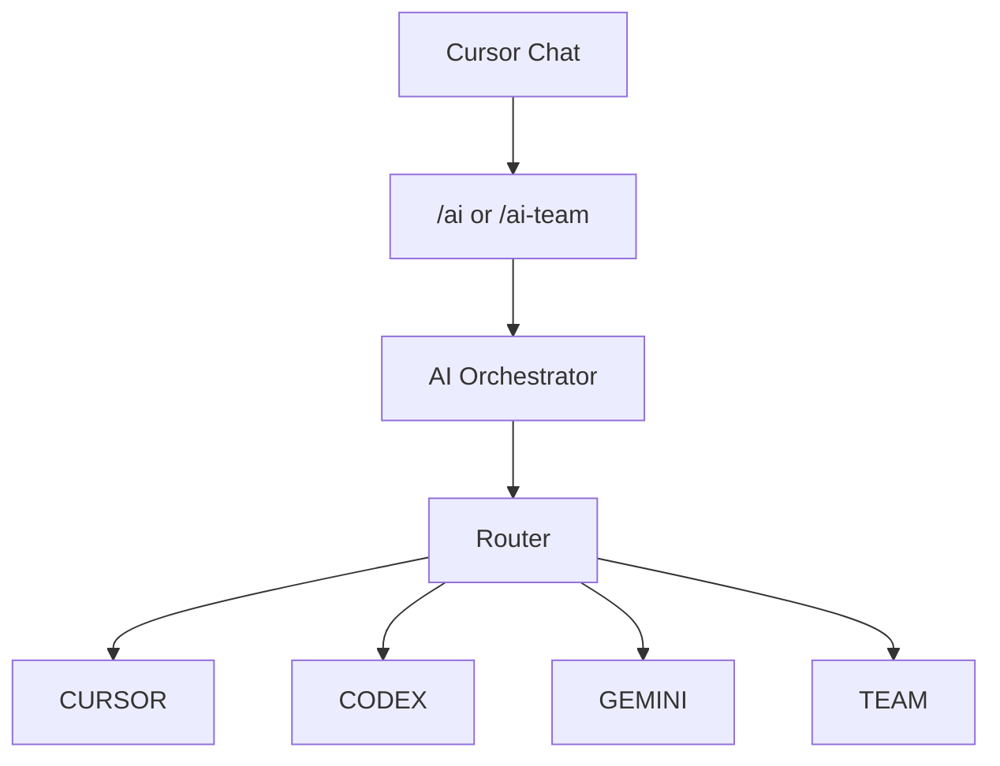

# Multi-Model AI Orchestrator

ارکستراتور محلی چندمدلی برای Cursor. به‌جای انتخاب دستی یک مدل برای هر کار، می‌تواند کار را بین Cursor Agent، OpenAI Codex، Google Gemini از طریق Antigravity، یا گردش‌کار TEAM تقسیم کند.

نسخه فعلی: **v0.8.0**

## این پروژه چیست

داخل Cursor، متن کار را یک‌بار می‌دهید. ارکستراتور مسیر مناسب را انتخاب می‌کند، تغییرات Git را در worktree ایزوله نگه می‌دارد، worker را اجرا می‌کند، و برای مسیرهای تغییردهنده تست واقعی پروژهٔ هدف را اجرا می‌کند.

مخزن بازشده در Cursor همان منبع کار است. پوشهٔ این پروژه فقط `runs/` و `worktrees/` را نگه می‌دارد.

پشتیبانی تأییدشده روی **Windows** است. Linux و macOS تأیید نشده‌اند.

## معماری



TEAM:

`Cursor plan → Codex implement → independent tests → Gemini review`

اگر بررسی `NEEDS_FIXES` بدهد یا تست شکست بخورد، Codex اصلاح می‌کند، تست دوباره اجرا می‌شود، و Gemini دوباره بررسی می‌کند. تعداد دورها محدود است (`--max-fix-rounds`، پیش‌فرض 2). Merge خودکار به main وجود ندارد.

## Cursor / Codex / Gemini / TEAM

| مسیر | کاربرد نمونه |
| --- | --- |
| `CURSOR` | UI، CSS، فرانت‌اند، ویرایش سریع |
| `CODEX` | کدنویسی متمرکز، بک‌اند، باگ، تست |
| `GEMINI` | تحلیل مخزن، معماری، بررسی، تحقیق read-only |
| `TEAM` | کار پیچیده/پرریسک: برنامه، پیاده‌سازی، تست، بررسی مستقل |

`--mode` صریح، مسیریابی خودکار را دور می‌زند. `agy` فقط نام قدیمی `gemini` است.

نمونه‌ها:

```text
/ai Improve the dashboard layout
/ai Fix the registration validation bug and add tests
/ai Analyze this repository and identify maintainability issues
/ai-team Refactor authentication across the application and add tests
```

## نصب

```powershell
git clone https://github.com/trisha918/multi-model-ai-orchestrator.git
cd multi-model-ai-orchestrator
npm install
npm run doctor
```

پیش‌نیازها: Windows، Git، Node.js 20+، npm، Cursor، Cursor Agent CLI، Codex CLI، Antigravity CLI.

## احراز هویت ابزارها

ارکستراتور کلید API داخل این مخزن ذخیره نمی‌کند.

- Codex: `codex login` سپس `codex login status`
- Antigravity / Gemini: ورود به Antigravity، سپس `agy models` باید بدون تغییر فایل موفق شود
- Cursor Agent: اجرای `login` روی `agent.cmd` کشف‌شده، سپس `status`

کشف Cursor Agent از `%LOCALAPPDATA%\cursor-agent\` است و به PATH وابسته نیست.

## نصب Skillها

```powershell
powershell -ExecutionPolicy Bypass -File .\scripts\install-cursor-skills.ps1
```

Skillها در `%USERPROFILE%\.cursor\skills\` نصب می‌شوند و به همین clone اشاره می‌کنند. Cursor را Restart یا Reload کنید.

پروژه‌ای را باز کنید که می‌خواهید روی آن کار شود، نه لزوماً مخزن ارکستراتور.

## استفاده از /ai

`/ai` با `--mode auto` اجرا می‌شود. روتر بین CURSOR، CODEX، GEMINI و TEAM انتخاب می‌کند.

```text
/ai Fix the registration validation bug and add tests
```

## استفاده از /ai-team

`/ai-team` همیشه `--mode team` است.

```text
/ai-team Refactor authentication across the application and add tests
```

اجرای دستی:

```powershell
npm run task -- --repo "C:\Projects\my-app" --mode auto --commit-on-pass --task "Fix the login bug and add tests"
```

حالت‌ها: `auto`، `cursor`، `codex`، `gemini`، `team`، و `agy` (سازگاری قدیمی).

## Git isolation

- کارهای تغییردهنده در worktree ایزوله زیر `worktrees/` اجرا می‌شوند.
- workspace اصلی باید تمیز بماند.
- اگر مخزن کثیف باشد اجرا رد می‌شود. ارکستراتور فایل‌های شما را reset یا پاک نمی‌کند.
- برای worktree حداقل یک commit اولیه لازم است.
- شاخه‌ها معمولاً `ai/<run-id>` هستند.
- merge یا push خودکار وجود ندارد.
- worktree موفق به‌صورت پیش‌فرض حذف می‌شود؛ worktree ناموفق برای دیباگ نگه داشته می‌شود.

## تست

```powershell
npm test
npm run cursor-test
npm run agy-test
npm run doctor
npm run cleanup
```

`npm test` منطق داخلی را بدون فراخوانی سرویس خارجی پوشش می‌دهد. `cursor-test` و `agy-test` به احراز هویت واقعی worker نیاز دارند.

## عیب‌یابی

### Cursor Agent شناخته نمی‌شود

مسیر `%LOCALAPPDATA%\cursor-agent\agent.cmd` یا `versions\<ver>\cursor-agent.cmd` را بررسی کنید. PATH لازم نیست.

### Workspace Trust Required

`--trust` فقط برای worktree تأییدشدهٔ ارکستراتور اعمال می‌شود. `--yolo` سراسری توصیه نمی‌شود.

### مخزن کثیف

```powershell
git status --short
```

تغییرات خود را commit یا stash کنید. ارکستراتور تغییرات کاربر را خودکار دور نمی‌ریزد.

### مخزن بدون commit اولیه

قبل از ساخت worktree یک commit اولیه بسازید.

### مشکل احراز هویت

`npm run doctor` و دستورهای login/status هر CLI را اجرا کنید.

### Antigravity / Gemini

Gemini در worktree ایزوله، با `--mode plan --sandbox` اجرا می‌شود. اگر فایل تغییر کند بررسی رد می‌شود.

## نکات امنیتی

- تسک‌ها ممکن است کد اجرا کنند.
- workerها می‌توانند داخل worktree فایل را تغییر دهند.
- همیشه از Git استفاده کنید و شاخهٔ AI را قبل از merge بررسی کنید.
- secret، token و فایل نشست را commit نکنید.
- bypass گستردهٔ مجوز توصیه نمی‌شود.
- شاخهٔ main به‌صورت خودکار merge نمی‌شود.

## پیکربندی

`AI_CURSOR_TIMEOUT_MS` (۵ دقیقه)، `AI_CODEX_TIMEOUT_MS` (۱۰ دقیقه)، `AI_GEMINI_TIMEOUT_MS` (۵ دقیقه)، `AI_TEST_TIMEOUT_MS` (۱۰ دقیقه)، `AI_WORKER_MAX_RETRIES` (۱)، `AI_KEEP_SUCCESS_WORKTREES` (false)، `AI_KEEP_FAILED_WORKTREES` (true).

## وضعیت پروژه

در حال توسعه فعال. نسخه فعلی v0.8.0. این مخزن فعلاً فایل License ندارد.

## سلب مسئولیت

کد تولیدشده توسط AI باید قبل از استقرار در محیط واقعی بررسی و تست شود.
