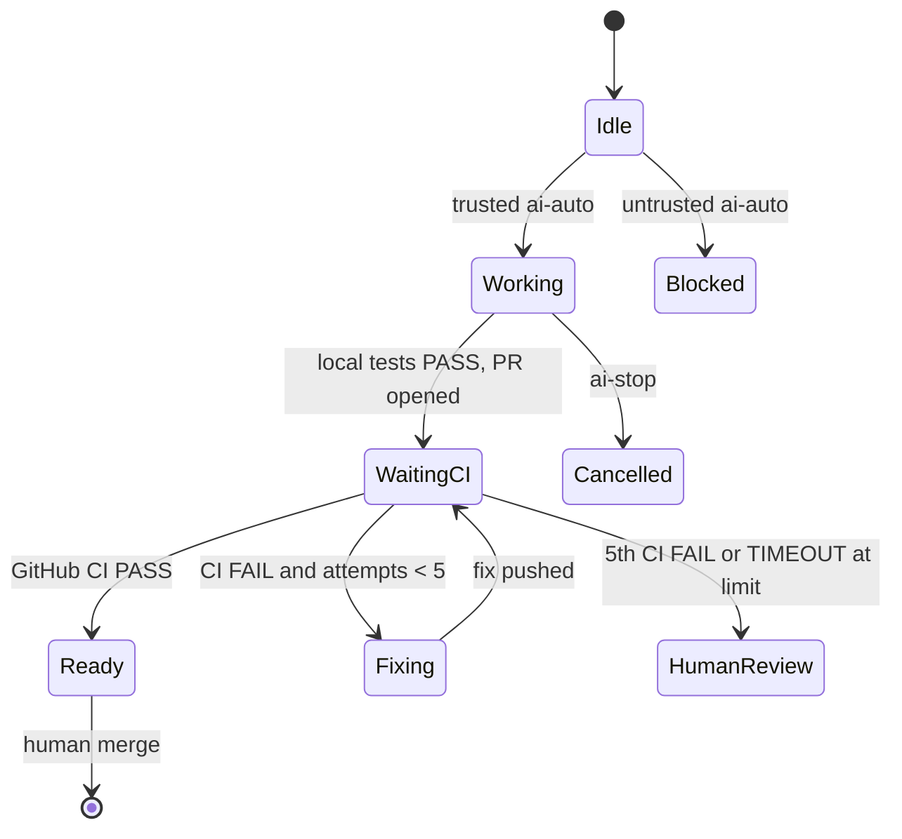

# GitHub automation

Optional v1.1 engine: **GitHub Issue → AI implementation → PR → CI → fix loop → ready for human merge**.

Default mode is **manual**. Nothing Issue-related runs until you enable a repository config **and** a trusted actor adds `ai-auto`.

## Modes

| Mode | v1.1 behavior |
| --- | --- |
| `manual` | Existing `/ai` commands only. No Issue automation. |
| `assisted` | Label-triggered implementation, tests, PR, CI watch, bounded fixes. Stops at ready for human merge. **No auto-merge. No auto-publish.** |
| `autonomous` | Recognized in config so later releases can add merge/deploy policy. **v1.1 still disables merge and publish.** Treat it like assisted for those policies. |

## Trigger

1. Issue created → idle.
2. Trusted OWNER / MEMBER / COLLABORATOR (or `allowed_actors`) adds `ai-auto`.
3. Automation may start.
4. Removing `ai-auto` prevents **new** runs where practical.
5. `ai-stop` cancels after the current safe boundary (no new worker, no extra fix push).

## Attempt limits

GitHub automation uses a top-level `max_fix_attempts` (default **5**, maximum 5).

This is separate from the local TEAM/worker fix rounds inside `runTask`.

After 5 failing GitHub CI observations the engine stops and requests human review. There is no attempt 6.

## PR and CI

Assisted mode pushes **only** the `ai/issue-...` branch (never `main`, never force-push) and opens one PR. Local tests are not GitHub CI. Checks are classified `PENDING`, `PASS`, `FAIL`, or `TIMEOUT`. Logs are fetched when the API allows and redacted before storage.

## State machine

Canonical allowed transitions live in `src/github-state.mjs` (`ALLOWED_TRANSITIONS`). Illegal moves are rejected.

| From | To | Trigger |
| --- | --- | --- |
| IDLE | STARTED / WORKING | Trusted `ai-auto` start |
| IDLE | BLOCKED | Untrusted trigger actor |
| IDLE | CONFLICT | Contradictory route/model labels |
| STARTED / WORKING | IMPLEMENTING | First implementation round |
| IMPLEMENTING | LOCAL_TESTS | Independent local tests PASS/SKIP |
| IMPLEMENTING | FAILED | Local tests FAIL |
| LOCAL_TESTS | WAITING_FOR_CI | Branch on remote + PR opened or reused |
| WAITING_FOR_CI | READY_FOR_HUMAN_MERGE | GitHub CI PASS |
| WAITING_FOR_CI | FIXING | CI FAIL/TIMEOUT and attempts remain |
| WAITING_FOR_CI | HUMAN_REVIEW_REQUIRED | Attempt limit, or CI PASS but required review/tests did not |
| WAITING_FOR_CI | FAILED | Resume CI sync sees FAIL (no extra fix start) |
| FIXING | WAITING_FOR_CI | Fix pushed (never force-push) |
| READY_FOR_HUMAN_MERGE | DONE | Human merged / closed (never auto-merge) |
| HUMAN_REVIEW_REQUIRED | WAITING_FOR_CI | Crash-recovery reconcile only (`unsafePushPending`) |

Terminal (no auto-advance): `FAILED`, `BLOCKED`, `DONE`, `CANCELLED`, `CONFLICT`.  
Human-gated: `READY_FOR_HUMAN_MERGE`, `HUMAN_REVIEW_REQUIRED`.

```text
ai-auto
  → ai-working
  → ai-needs-test
  → (CI fail) ai-test-failed → ai-fixing → ai-needs-test
  → (success) ai-ready-to-merge
  → (limit / conflict / stop) ai-human-review
  → (closed) ai-done
```

Contradictory status labels are removed when a new status is applied.

## Human stop and review

- `ai-stop` → `CANCELLED` / `ai-human-review`
- Untrusted `ai-auto` → `AUTOMATION BLOCKED` / untrusted trigger actor
- Max attempts or unrecoverable CI → `HUMAN REVIEW REQUIRED`
- Crash during push → do not blindly push again; resume requires a clear state or human confirmation



State files live under `%LOCALAPPDATA%\MultiModelAIOrchestrator\github-automation\` (no credentials).

## First live test

Use a **private** repo (`ai-orchestrator-e2e-test`) and the template in `examples/github-e2e-test/`. Full Windows steps: [GITHUB-LIVE-TEST.md](GITHUB-LIVE-TEST.md).

Workflow security: hosted `authorize` job (collaborator permission) **then** self-hosted AI job. `GITHUB_TOKEN` only.

## Quick start

1. Install `ai-orchestrator` (`.\install.ps1`).
2. Register a Windows self-hosted runner on the **private** test repo; add label `ai-orchestrator`.
3. `.\scripts\verify-ai-runner.ps1`
4. Copy example config/workflows from `examples/github-e2e-test`.
5. `ai-orchestrator github labels setup --repo OWNER/ai-orchestrator-e2e-test`
6. Create Issue without `ai-auto`.
7. Maintainer adds `ai-auto`.
8. Watch branch/PR/CI.
9. Merge manually after READY.
